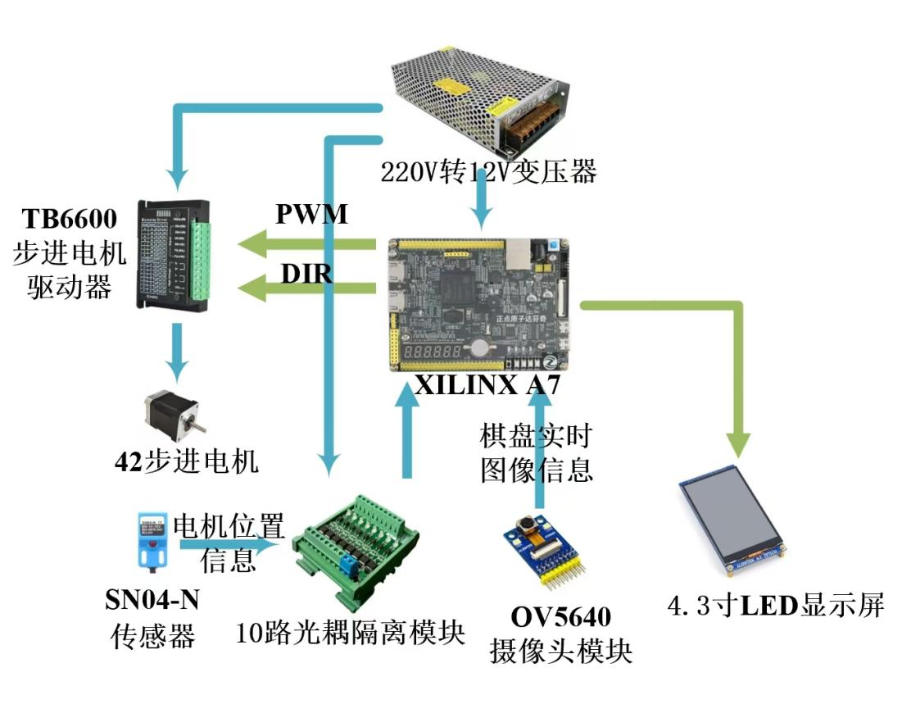

# FPGA三子棋机器人
## 简介
这是我们用纯Verilog制作的三子棋机器人，参加全国大学生芯片与系统设计大赛FPGA赛道获得一等奖。机器主要由图像识别部分，下棋预测部分和电机驱动部分组成，机器能够保证在与玩家对战过程中，机器一方不会落败。玩家下棋后，机器摄像头自动识别棋子位置，通过我们编写的verilog算法自动计算下一步下棋位置，随后控制步进电机夹取棋子和玩家对弈。此外，还支持电机自动校准复位，棋子自动复位，触摸屏可视化调颜色阈值，LCD屏幕实时显示处理前后图像和棋局状态等功能。系统结构图如下图所示：

## 演示视频
https://www.bilibili.com/video/BV1N1zCYzEWG
## 使用方法
1.参考上面的系统结构图工程代码的xdc文件搭建电路，电机驱动模块和其他电路，SN04-4传感器的电源接12V电压，输出信号使用12V转3.3V的光耦隔离模块来转换成3.3V电压供FPGA读取，OV5640和LCD模块连接方法参考达芬奇开发板教程，步进电机驱动器的接法和网上常用接法一致。
2.下载程序，如果摄像头的ROI区域位置和大小与实际有偏差，或者需要调节颜色阈值范围，可以在VIO里面进行手动调节。
## 参考资料
[1] 手把手教你学达芬奇&达芬奇Pro之FPGA开发篇【真人出镜】FPGA教学视频教程. (n.d.). Retrieved November 11, 2024, from https://www.bilibili.com/video/BV1E94y1p7jk
[2] 正点原子手把手教你学FPGA-基于达芬奇Pro开发板 Artix-7 XC7A35T/XC7A100T. (n.d.). Retrieved November 11, 2024, from https://www.bilibili.com/video/BV19A411N7L3
[3] C语言实现“井字棋”游戏（三子棋）人机对弈. (2020, January 1). CSDN. Retrieved November 11, 2024, from https://blog.csdn.net/qq_58284486/article/details/122270775